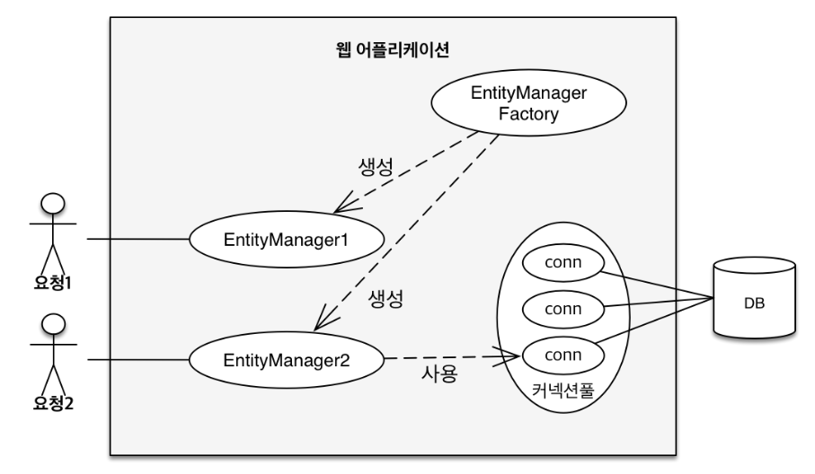
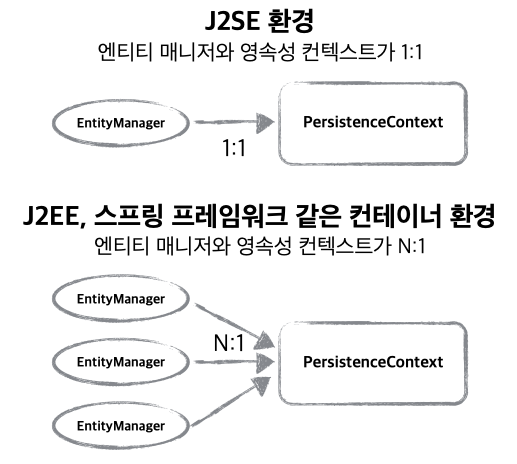
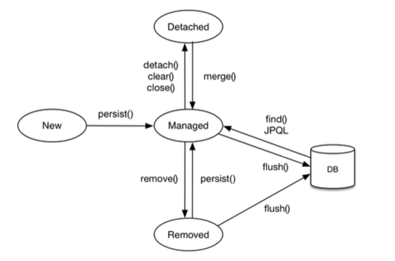
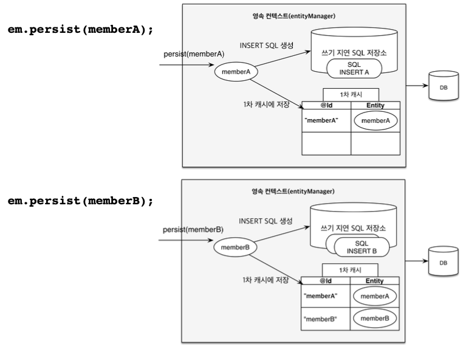
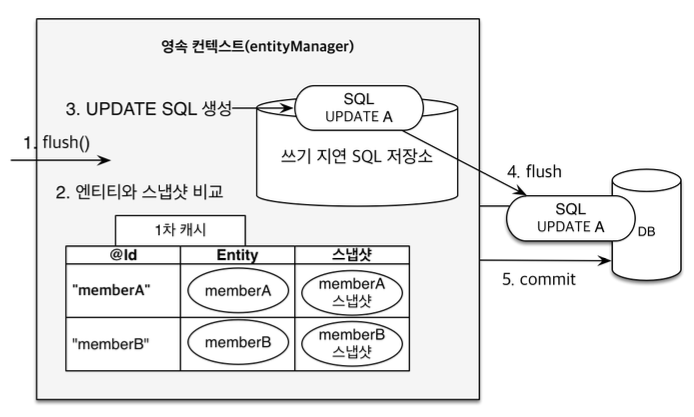

### JPA에서 가장 중요한 2가지<hr>
1. 객체와 관계형 데이터베이스 매핑하기 (ORM)<br>
   정적인 매핑 과정 (JPA 내부 구조)
2. 영속성 컨텍스트<br>
    동적인 실제 메커니즘 (JPA 내부 동작)

* 엔티티 매니저 (entityManager)
    <br>
    엔티티 매니저는 사용자의 요청이 있을 때, 엔티티 매니저 팩토리에 의해 생성되며 내부적으로 DB Connection Pool을 사용해 DB에 접근한다.

### 영속성 컨텍스트 (Persistence Context)<hr>

* 뜻 : 엔티티를 영구 저장하는 환경
* 영속성 컨텍스트는 논리적인 개념으로 눈에 보이지 않으며, 엔티티 매니저를 통해 영속성 컨텍스트에 접근할 수 있다.
* persist()는 DB에 저장하는 것이 아니라, 영속성 컨텍스트에 객체를 저장하는 것이다. 즉, 영속성 컨텍스트를 통해 객체를 영속화한다는 뜻으로 객체는 JPA에 의해 관리된다.
  

### 엔티티의 생명주기<hr>

* 비영속 (new/transient) : 영속성 컨텍스트와 전혀 관계가 없는 새로운 상태
* 영속 (managed) : 영속성 컨텍스트에 의해 관리되는 상태
* 준영속 (detached) : 영속성 컨텍스트에 저장되었다가 분리된 상태
* 삭제 (removed) : 삭제된 상태
    

```java
Member member = new Member();
member.setId(200L);
member.setName("HelloA");
//-> 비영속 상태

em.persist(member);
//-> 영속 상태 (데이터베이스에는 저장되지 않은 상태)

em.detach(member);
//-> 준영속 상태
```

### 영속성 컨텍스트의 이점<hr>
1. 1차 캐시<br>
    영속성 컨텍스트는 컨텍스트 내부에 1차 캐시를 들고 있다.<br>
    persist : 객체를 영속화하고 영속성 컨텍스트의 1차 캐시에 저장한다.<br>
    1차 캐시에는 < @Id, entity >의 형태로 저장된다.<br>
  * 1차 캐시의 이점<br>
    * entityManager.find() 시에 JPA는 영속성 컨텐스트의 1차 캐시를 확인한 후, 엔티티가 존재한다면 캐시값을 조회한다. (select 쿼리가 나가지 않음)<br>
        ```java
        Member member = new Member();
        member.setId(201L);
        member.setName("HelloA");
        em.persist(member);

        Member findMember = em.find(Member.class, 201L);
        ```
        ```
        Hibernate: 
        /* insert hellojpa.Member
            */ insert 
            into
                Member
                (name, id) 
            values
                (?, ?)
        ```
        => persist시에 member 객체가 1차 캐시에 저장되어 find시에 DB에 select 쿼리를 날려서 조회하지 않고, 캐시값을 반환했다.
    * 1차 캐시에 값이 존재하지 않을 경우, DB에서 조회를 하고 1차 캐시에 저장하여 나중에 다시 캐시값을 사용할 수 있도록 한다.
        ```java
        Member findMember = em.find(Member.class, 201L);
        ```
        ```
        Hibernate: 
        select
            member0_.id as id1_0_0_,
            member0_.name as name2_0_0_ 
        from
            Member member0_ 
        where
            member0_.id=?
        ```
        => 1차 캐시에 엔티티가 존재하지 않는 경우, DB에 select 쿼리를 날려서 데이터를 조회한다.


2. 동일성 보장<br>
    영속성 컨텍스트는 관리하는 객체의 동일성을 보장한다.<br>
    자바 컬렉션이 값이 같은 객체의 동일성을 보장하는 것과 같이 동작한다.<br>
    1차 캐시로 반복 가능한 읽기(repeatable read) 등급의 트랜잭션 격리 수준을 애플리케이션 차원에서 제공한다.<br>
    ```java
    Member member1 = em.find(Member.class, 100L);
    Member member2 = em.find(Member.class, 100L);
    System.out.println("member1 : " + member1 + "\nmember2 : " + member2 + "\nequals : " + (member1 == member2));
    ```
    ```
    Hibernate: 
    select
        member0_.id as id1_0_0_,
        member0_.name as name2_0_0_ 
    from
        Member member0_ 
    where
        member0_.id=?
    member1 : hellojpa.Member@312b34e3
    member2 : hellojpa.Member@312b34e3
    equals : true
    ```
    => member2를 조회할 때 select 쿼리가 발생하지 않고, 1차 캐시에서 조회한 것을 알 수 있다. 이때 주소값이 동일한 것을 확인할 수 있다.

3. 트랜잭션을 지원하는 쓰기 지연 (transactional write-behind) (버퍼링)
    <br>
    트랜잭션은 persist, remove 등의 함수에 대해 즉각적으로 DB 쿼리를 날리지 않는다. 엔티티는 1차 캐시에 저장하고 쿼리는 쓰기 지연 SQL 저장소에 저장했다가 컨텍스트가 커밋되는 시점에 flush 하면서 한 번에 쿼리를 날린다.<br>
    ```java
    Member member = new Member(300L, "A");
    em.persist(member);

    System.out.println("=== Before Commit ===");
    tx.commit();
    System.out.println("=== After Commit ===");
    ```
    ```
    === Before Commit ===
    Hibernate: 
        /* insert hellojpa.Member
            */ insert 
            into
                Member
                (name, id) 
            values
                (?, ?)
    === After Commit ===
    ```
    => persist를 하는 순간이 아니라, 컨텍스트를 커밋하는 시점에 쿼리가 발생하는 것을 확인할 수 있다.

4. 변경 감지 (Dirty Checking)
    <br>
    setter를 사용하여 객체의 값을 변경하면 알아서 변경 사항을 감지하고 update 쿼리를 날려준다. 1차 캐시에 변경 사항을 저장해뒀다가 flush시에 변경 사항이 있는 것에 대하여 쓰기 지연 SQL 저장소에 sql을 저장하고 DB에 flush + commit 한다.<br>
    ```java
    Member findMember = em.find(Member.class, 300L);
    findMember.setName("findMember");

    System.out.println("=== Before Commit ===");
    tx.commit();
    System.out.println("=== After Commit ===");
    ```
    ```
    Hibernate: 
    select
        member0_.id as id1_0_0_,
        member0_.name as name2_0_0_ 
    from
        Member member0_ 
    where
        member0_.id=?
    === Before Commit ===
    Hibernate: 
        /* update
            hellojpa.Member */ update
                Member 
            set
                name=? 
            where
                id=?
    === After Commit ===
    ```
    => persist를 하지 않아도 setter로 값을 변경한 것을 감지하여 알아서 update 쿼리를 날리는 것을 확인할 수 있다.
    이때도 쓰기 지연을 확인할 수 있다.

5. 지연 로딩 (Lazy Loading)

### 플러시<hr>

* 영속성 컨텍스트의 변경 내용을 데이터베이스에 반영
* 플러시가 발생하는 경우
    1. 변경 감지
    2. 수정된 엔티티 쓰기 지연 SQL 저장소에 등록
    3. 쓰기 지연 SQL 저장소의 쿼리를 데이터베이스에 전송 (등록, 수정, 삭제 쿼리)

* 영속성 컨텍스트를 flush하는 방법
    1. em.flush() : 직접 호출
        ```java
        Member member = new Member(301L, "AAA");
        em.persist(member);
        em.flush();

        System.out.println("=== Before Commit ===");
        tx.commit();
        System.out.println("=== After Commit ===");
        ```
        ```
        Hibernate: 
            /* insert hellojpa.Member
                */ insert 
                into
                    Member
                    (name, id) 
                values
                    (?, ?)
        === Before Commit ===
        === After Commit ===
        ```
        => flush를 하는 시점에 쿼리가 날라가는 것을 확인할 수 있고, 이 때 쓰기 지연 SQL 저장소가 비워지므로 커밋 시에 쿼리가 중복으로 발생하지 않는다.
    2. 트랜잭션 커밋 : 플러시 자동 호출
    3. jpql 쿼리 실행 : 플러시 자동 호출<br>
        jpql 쿼리 실행 시, 쓰기 지연 SQL 저장소와 동기화가 되지 않는 문제를 피하기 위해 flush를 하고 쿼리를 실행한다.

* flush 모드 옵션
  * FlushModeType.AUTO : 커밋, 쿼리 실행 시 플러시
  * FlushModeType.COMMIT : 커밋 시에만 플러시 (jpql 쿼리 실행 시, 플러시를 하고 싶지 않은 경우에 사용 가능)

* flush 특징
  * 영속성 컨텍스트를 비우지 않음 (1차 캐시 유지)
  * 영속성 컨텍스트의 변경내용을 데이터베이스에 동기화
  * 트랜잭션이라는 작업 단위가 중요 -> 커밋 직전에만 동기화 하면 됨

### 준영속 상태<hr>
* 영속 상태의 엔티티가 영속성 컨텍스트에서 분리된 상태 (detached)
* 영속성 컨텍스트가 제공하는 기능을 사용할 수 없음
* 준영속 상태로 만드는 방법
    1. em.detach(entity)
        ```java
        Member member = em.find(Member.class, 170L);
        em.detach(member);

        member.setName("DDD");
        tx.commit();
        ```
        ```
        Hibernate: 
        select
            member0_.id as id1_0_0_,
            member0_.name as name2_0_0_ 
        from
            Member member0_ 
        where
            member0_.id=?
        ```
        => member가 준영속 상태가 되어서 setter로 인한 변경 감지가 되지 않는 것을 확인할 수 있다.
    2. em.clear() : 영속성 컨텍스트 초기화
        ```java
        em.find(Member.class, 170L);
        em.clear();

        em.find(Member.class, 170L);
        ```
        ```
        Hibernate: 
            select
                member0_.id as id1_0_0_,
                member0_.name as name2_0_0_ 
            from
                Member member0_ 
            where
                member0_.id=?
        Hibernate: 
            select
                member0_.id as id1_0_0_,
                member0_.name as name2_0_0_ 
            from
                Member member0_ 
            where
                member0_.id=?
        ```
        => 컨텍스트를 초기화하고 나면 1차 캐시의 내용도 지워지기 때문에 두번째로 조회를 했을 때, select 쿼리가 다시 나가는 것을 확인할 수 있다.
    3. em.close()
<br>

* 참고로 알면 좋은 것<br>
영속성 컨텍스트와 트랜잭션 주기를 맞춰서 설계를 해야 동기화 문제가 발생하지 않는다.<br>
애플리케이션 전체에서 공유되는 2차 캐시라는 것이 있다.<br>
JDBC batch는 jdbc.batch_size만큼 한번에 모아서 데이터베이스를 변경한다. (버퍼링, 쓰기 지연)

### 용어 정리
* J2EE : Java 2 Enterprise Edition, 전사적 차원에서 필요로 하는 웹 애플리케이션 관련 기술으로 자바 개발을 위한 라이브러리 포함
* J2SE : Java 2 Standard Edition, Java 언어를 이용해 애플리케이션, 애플릿, 컴포넌트 등을 개발하고 실행할 수 있는 환경을 제공하는 플랫폼
