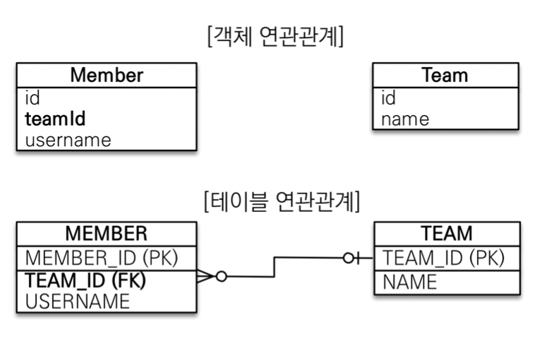
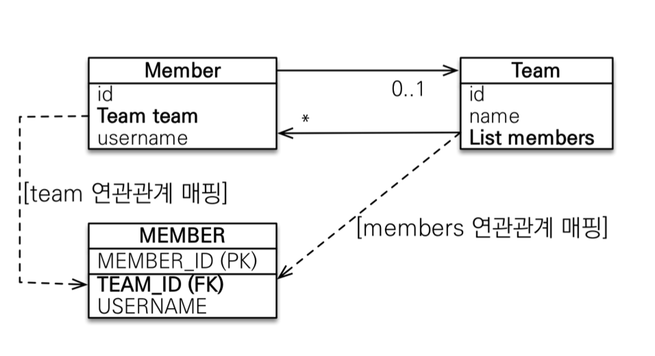
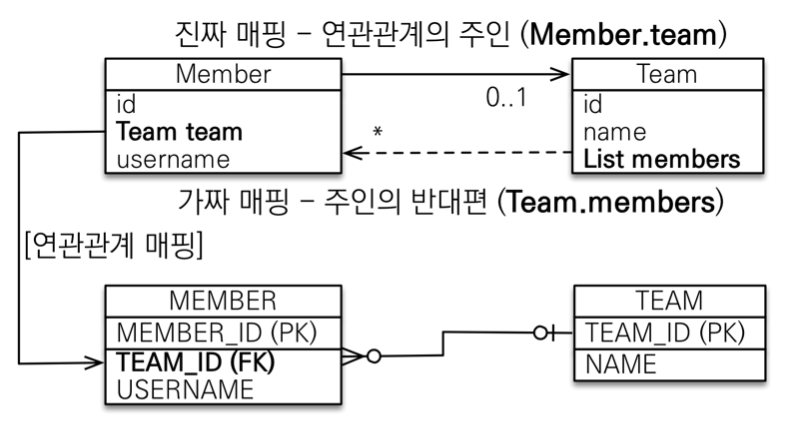
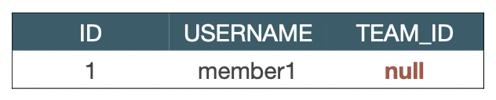

### 연관관계가 필요한 이유
<hr>
 
***객체지향 설계의 목표는 자율적인 객체들의 협력 공동체를 만드는 것이다.***

* 연관관계없이 외래키만 그 자체로 저장했을 때 (객체를 테이블에 맞추어 데이터 중심으로 모델링 했을 때)의 문제점 : 객체지향 설계 목표에 어긋나게 객체끼리 협력할 수 없는 관계가 된다.
  
  * 객체끼리는 참조를 통해 값을 얻을 수 있는데, 외래키 값 자체만을 가지고 있으면, 그 값으로 다시 객체를 찾아야 한다.
* 테이블과 객체의 패러다임 차이
  * 테이블 : 외래 키로 조인하여 연관된 테이블을 찾는다.
  * 객체 : 참조를 사용해 연관된 객체를 찾는다.

### 단방향 연관관계
<hr>

* 객체 : 단방향
* 테이블 : 양방향 (외래 키 값으로 양쪽 테이블 어디서든 조회할 수 있다는 것이지 사실상 방향으로 말하기는 어렵다.)
* jpa에게 관계를 알려줘야 하기 때문에 다양한 매핑 애노테이션을 사용한다.
* member 참조와 member 테이블의 외래키를 매핑해야 한다.
* 연관관계를 가지도록 매핑했을 때, 아래와 같이 참조를 이용해 연관 관계에 있는 객체를 조회할 수 있다.
  ```java
  Order findOrder = em.find(Order.class, order.getId());
  Member findMember = findOrder.getMember();
  System.out.println("findMember : " + findMember.getId());
  ```
* 객체의 참조값을 변경하여 연관관계에 있는 객체를 바꾸고, 외래키를 수정할 수 있다.
  ```java
  Member member = new Member("user1", "seoul", "daero", "1232");
  em.persist(member);

  Order order = new Order(member, LocalDateTime.now(), OrderStatus.ORDER);
  em.persist(order);

  Member newMember = new Member("user2", "daegu", "daero", "1919");
  em.persist(newMember);

  em.flush();
  em.clear();

  Order findOrder = em.find(Order.class, order.getId());
  System.out.println("member : " + findOrder.getMember().getName());

  findOrder.setMember(newMember);

  em.flush();
  em.clear();

  Order findOrder2 = em.find(Order.class, order.getId());
  System.out.println("change memger : " + findOrder2.getMember().getName());

  ```
  ```
  member : user1

  ... hibernate query ...

  change memger : user2
  ```
* 지연로딩 전략  
  외래 관계에 있는 객체의 매핑 속성에 LAZY fetch를 주어 지연로딩 전략을 사용할 수 있다. 연관 관계의 객체의 정보까지 가지고 올 필요가 없을 때 지연로딩 전략을 사용할 수 있다. 필요없는 정보를 가지고 오느라 시간과 메모리를 낭비하지 않을 수 있다. 나중에 연관 관계의 객체에 대한 정보가 필요할 때, getter만 이용하여 정보를 가지고 올 수 있다.
  <br>
  ```java
  @ManyToOne(fetch = FetchType.LAZY)
  private Member member;
  ```
  <br>
  아래의 코드에 대해 지연 로딩을 썼을 떄와 쓰지 않았을 때를 비교해 볼 것이다.

  ```java
    Order findOrder = em.find(Order.class, order.getId());
    findOrder.getMember().getName();
  ```
  * 지연 로딩 전략 사용 x  
  => order를 조회할 때, member까지 같이 select하여 정보를 조회한다.
  ```
  Hibernate: 
    select
        order0_.order_id as order_id1_9_0_,
        order0_.delivery_id as delivery4_9_0_,
        order0_.member_member_id as member_m5_9_0_,
        order0_.orderDate as orderdat2_9_0_,
        order0_.status as status3_9_0_,
        member1_.member_id as member_i1_6_1_,
        member1_.city as city2_6_1_,
        member1_.name as name3_6_1_,
        member1_.street as street4_6_1_ 
    from
        orders order0_ 
    left outer join
        Member member1_ 
            on order0_.member_member_id=member1_.member_id 
    where
        order0_.order_id=?
  ```

  * 지연 로딩 전략 사용  
    => order를 조회할 때, member를 같이 조회하지 않고, member에 대한 정보가 필요할 떄 member를 select하여 값을 가지고 온다.
    ```
    Hibernate: 
      select
          order0_.order_id as order_id1_9_0_,
          order0_.delivery_id as delivery4_9_0_,
          order0_.member_member_id as member_m5_9_0_,
          order0_.orderDate as orderdat2_9_0_,
          order0_.status as status3_9_0_ 
      from
          orders order0_ 
      where
          order0_.order_id=?
  Hibernate: 
      select
          member0_.member_id as member_i1_6_0_,
          member0_.city as city2_6_0_,
          member0_.name as name3_6_0_,
          member0_.street as street4_6_0_ 
      from
          Member member0_ 
      where
          member0_.member_id=?
    ```


### 양방향 연관관계와 연관관계의 주인
<hr>

* 1 : n 관계일 때
  * 위의 예제처럼 n 쪽에서는 이미 단방향으로 1에 대한 연관관계를 매핑했다. 객체 입장에서는 사실상 양방향 관계가 아니라 2개의 단방향 관계를 형성해 양방향처럼 보이게 한다. 따라서 1 쪽에서도 단방향 연관관계를 매핑하여 양방향으로 만들 수 있다.
  * 1에서는 다수의 객체와 연관관계를 가져야 하기 때문에 리스트로 관리한다.
    ```java
      @Entity
      public class Member{

          @Id
          @GeneratedValue
          private Long id;

          @ManyToOne
          private Team team;
      }
    ```
    ```java
      @Entity
      public class Team {
          @Id
          @GeneratedValue
          private Long id;

          //여기서 team은 Member의 team을 의미한다.
          @OneToMany(mappedBy = "team")
          private List<Member> members = new ArrayList<>();
      }

    ```
* 1 : 1 관계일 때
  * 이 경우, 양쪽 모두 하나의 객체와 연관관계를 가지므로 양쪽 다 @OneToOne 애노테이션을 이용해 매핑한다.
    ```java
      @Entity
      public class Member{

          @Id
          @Column
          private Long id;

          @OneToOne
          private Team team;
      }
    ```
    ```java
      @Entity
      public class Team {
          @Id
          @GeneratedValue
          private Long id;

          @OneToOne(mappedBy = "team")
          private Member member;
      }

    ```

* 양방향 연관관계에서 주인이 필요한 이유  
  * 테이블은 외래키를 한 테이블에서 관리한다.
  * 양방향 연관관계를 가진 객체는 양쪽에서 외래키를 관리할 수 있다.
    
    ```java
      // member : team = 1 : n => 양방향 연관관계를 가지는 상태
      member.setTeam(team);
      team.getMembers().add(member);
    ```
    => 두 개 중 어떠한 것을 실행해도 똑같은 결과가 나온다.
  * 따라서 주인을 정해 주인이 아닌 쪽에서는 외래키를 수정할 수 없도록 해야 한다.
  * mappedBy : 연관관계의 주인을 정하는 속성  
    => ***보통은 1:n 중 n(외래키가 있는 곳)을 주인으로 지정한다.*** 현재 예제에서는 member가 주인!
    
    => team에 두면 team.getMembers().add(member);를 했을 때, member 테이블에 update 쿼리가 나간다. 이는 직관적으로 이해하기도 어렵고, 성능 문제가 있다.

#### 주의점, 정리

* 양방향 매핑 시 가장 많이 하는 실수
  * 연관관계의 주인에 값을 입력하지 않음 (역방향에만 연관관계 설정)  
    ```java
      // member.setTeam(team);
      team.getMembers().add(member);
    ```
    team은 오직 읽기 전용으로 연관 객체를 참조하므로 insert 쿼리가 발생하지 않는다.
    
  * 순수한 객체 관계를 고려하면 항상 양쪽 다 값을 입력해야 한다.  
    => 양쪽이 다 서로를 참조하고 있으므로, 참조값을 다 넣어주는 것이 좋다.
    ```java
      member.setTeam(team);
      team.getMembers().add(member);

      //member class 내부
      // 아래와 같이 편의 메서드를 만들어 사용하는 것이 좋다. setter를 private으로 설정할 수 있음.

      public void changeTeam(Team team) {
        team.getMembers().add(this);
        this.setTeam(team);
      }
    ```
    => team의 member 리스트에 참조값을 넣어 주지 않았을 때, 1차 캐시에서 값을 조회해서 오는 경우, team 리스트에 member가 존재하지 않을 수 있다.

  * 무한 루프  
    * ex. toString(), lombok, JSON 생성 라이브러리
    * member.toString()에서 team 객체를 그대로 반환할 경우, team.toString()을 호출하고, 여기서 또 member.toString()을 호출하게 되어 무한 루프에 빠질 수 있다.
    * JSON 생성 라이브러리도 마찬가지. (특히나 JSON 반환 시에 dto를 만드는 것은 엔티티가 변경됨에 따라 api 스펙이 바뀌는 것을 예방할 수 있다.)

### 실전예제 - 연관관계 매핑 시작
<hr>

### 참고사항
<hr>

* member의 team을 조회할 때, team의 member id를 가지고 찾아야지, member를 호출해서 getTeam을 하는 것은 잘못된 설계, 불필요한 양방향 설정을 할 필요도 없다.  
  => 비즈니스 로직 상에서 보자면 끊어내야 할 관심사를 제대로 끊어내지 못한 것.
