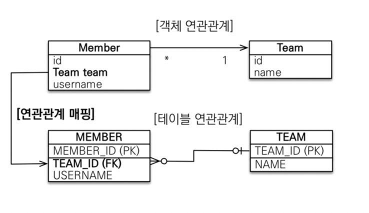
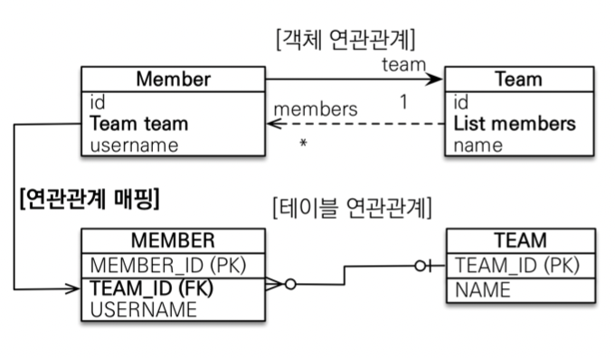
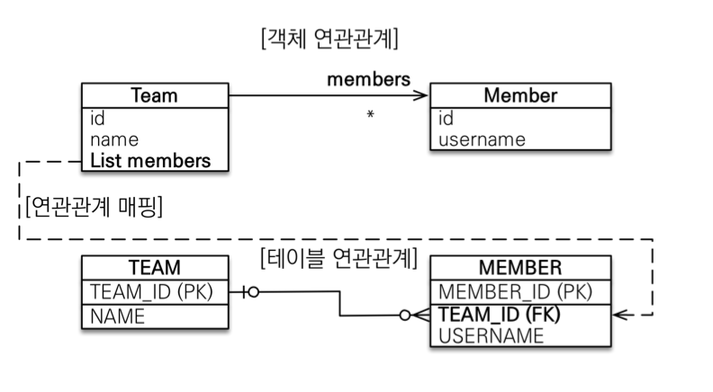
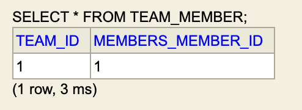
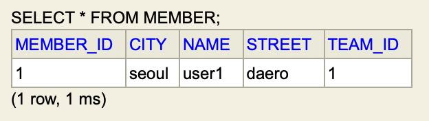
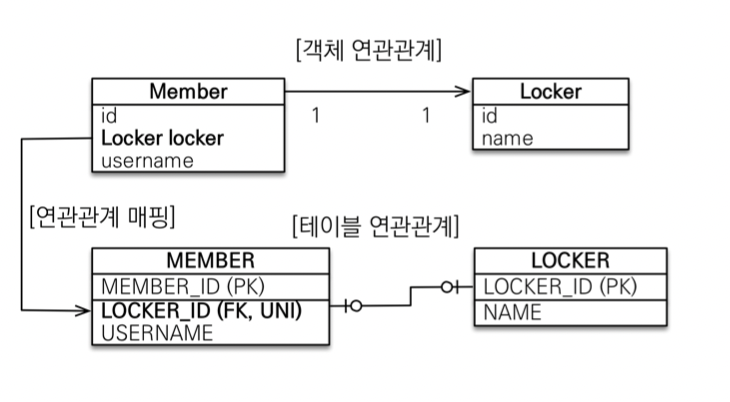
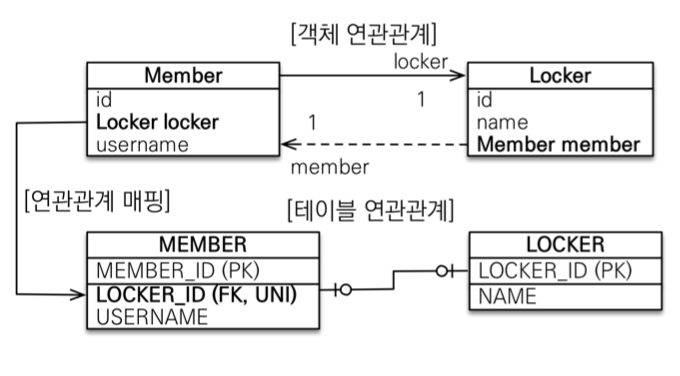
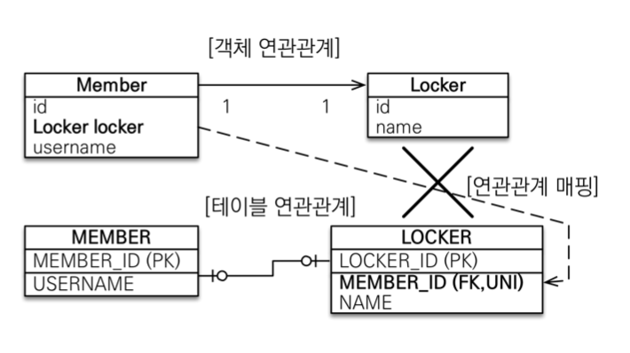
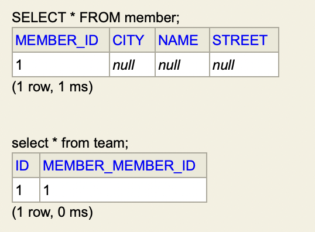

### 연관관계 매핑 시 고려사항
<hr>

1. 다중성  
    일대다, 다대일, 일대일, 다대다
2. 단방향, 양방향  
    객체에서는 사실상 양방향은 단방향이 2개인 것
3. 연관관계의 주인  
    외래키가 있는 곳에 연관관계의 주인을 둘 것  
    주인이 아닌 곳은 읽기 전용

### 다대일 (n:1)
<hr>

* 단방향 : 가장 많이 사용  
    
* 양방향 : 외래키가 있는 쪽이 주인
    

### 일대다 (1:n)
<hr>

* 단방향  
    
  * 1이 연관관계의 주인
  * 다 쪽에 외래키 존재
  * 반대편 테이블의 외래 키를 관리하는 특이한 케이스
  * @JoinColumn을 사용하지 않으면 자동으로 join table 방식을 사용한다.  
    자동으로 Team_Member 테이블을 생성하고, tema_id와 member_id를 저장한다. 따라서 팀을 만들어 저장하고, 멤버를 만들어 팀을 지정하고 저장할 때보다 쿼리가 한 번 더 나간다.
    ```java
    Member member = new Member("user1", "seoul", "daero", "1232");
    em.persist(member);

    Team team = new Team();
    em.persist(team);

    team.getMembers().add(member);
    ```
    * join table 방식
    ```
    Hibernate: 
        alter table Team_Member 
        add constraint FK267gfjokmdychsnik3u313q5j 
        foreign key (Team_id) 
        references Team

    Hibernate: 
        /* insert collection
            row hellojpa.jpashop.domain.Team.members */ insert 
            into
                Team_Member
                (Team_id, members_member_id) 
            values
                (?, ?)
    ```
    <br>

    * join column 방식
    ```java
    @OneToMany
    @JoinColumn(name = "team_id")
    private List<Member> members = new ArrayList<>();
    ```
    ```
    Hibernate: 
        /* create one-to-many row hellojpa.jpashop.domain.Team.members */ update
            Member 
        set
            team_id=? 
        where
            member_id=?
    ```
    
  * 권장하지 않는 방법
  * 객체 입장에서는 이렇게 설계될 확률이 높은데, 테이블은 무조건 타 쪽에 외래키가 들어가서 무조건 다른 테이블에 쿼리를 날리게 되는 상황이 된다.
  * ***Member에서 Team을 조회할 일이 없더라도 (객체지향적으로 손해지만) Member쪽에 Team과 연관관계를 만들어주는 것이 개발 생산성에 도움이 된다.***


* 양방향
  * 스펙상 지원이 되는 것은 아님
  * 1쪽이 연관관계의 주인이 된다.
  * '다'쪽에 @JoinColumn(insertable = false, updatable = false) 속성을 준다.

### 일대일 (1:1)
<hr>

* 외래키를 주 테이블, 대상 테이블 어느 쪽에 둬도 상관없다.
  * 단방향  
    
  * 양방향  
    
* 외래키에 유니크 제약조건을 무조건 추가해야 한다.
* 무조건 외래키가 있는 곳이 주인
* ***어떤 테이블에 외래키를 두는 게 더 좋은 지 한 번 생각해보자***
  * 데이터베이스 측면  
    일반적으로 대상 테이블에 외래키를 둔다.  
    하나의 멤버가 여러 개의 Locker를 가질 수 있다고 정책이 바뀌면 Locker만 수정하면 되므로 Locker가 가지고 있는 것이 유리하다. 반대로 여러 멤버가 하나의 Locker를 가질 수 있다면 Member쪽이 유리. 유니크 제약 조건만 빼면 된다. => 일대다로 바꾸기 쉽다.  
    단점 : 프록시 기능 한계로 항상 즉시 로딩
    
  * 개발자 측면
  * 일반적으로 주 테이블에 외래키를 둔다.  
    => JPA 매핑이 편리하다.  
    Member가 갖는 것이 유리. 비즈니스 로직 대부분에서 멤버를 조회하게 되므로, 멤버를 기준으로 데이터를 다루는 것이 쉬운 그림이다. => 주 테이블만 조회해도 값이 존재하는지 알 수 있다.  

* 일대다 단방향처럼 상대 테이블의 외래키를 다루는 것  
    => 일대일 단방향 x, 일대일 양방향 o
    

* 상대 테이블에 있는 값을 알고 싶을 때 양방향을 걸 수 밖에 없다.
* 일대일 관계에서 주인이 아닌 곳은 지연 로딩을 걸어도 항상 즉시 로딩한다.
  * oneToMany의 경우 컬렉션이 자체적으로 empty 값을 나타낼 수 있다.
  * oneToOne의 경우 객체는 null이거나 프록시가 되어야 한다. 항상 프록시로 두었을 때, 값이 null인지 알 수 없다.
  * 로딩 조건을 걸지 않았을 때 (EAGER일 때)
    ```
    Hibernate: 
        select
            team0_.id as id1_11_0_,
            team0_.member_member_id as member_m2_11_0_,
            member1_.member_id as member_i1_6_1_,
            member1_.city as city2_6_1_,
            member1_.name as name3_6_1_,
            member1_.street as street4_6_1_ 
        from
            Team team0_ 
        left outer join
            Member member1_ 
                on team0_.member_member_id=member1_.member_id 
        where
            team0_.id=?
    ```
  * LAZY 로딩 조건을 걸었을 때  
    => 주인은 외래 키 값이 null일 때, 연관관계의 객체가 null이라는 것을 바로 알 수 있기 때문에 member를 로딩하지 않는다. 하지만 member는 team을 로딩하지 않고는 null 여부를 알 수 없기 때문에 로딩해야 한다.  
    team (주인)
    ```
    Hibernate: 
        select
            team0_.id as id1_11_0_,
            team0_.member_member_id as member_m2_11_0_ 
        from
            Team team0_ 
        where
            team0_.id=?
    ```
    member (주인 아님)  
    LAZY일 때와 EAGER일 때의 차이가 있다면 LAZY일 때는 쿼리가 분리돼서 나온다는 것이다. 처음에는 지연 로딩 조건에 따라 member 조회 쿼리만 나오지만 즉시 team을 조회할 수 밖에 없기 때문에 추가 쿼리가 나온다.
    ```
    Hibernate: 
        select
            member0_.member_id as member_i1_6_0_,
            member0_.city as city2_6_0_,
            member0_.name as name3_6_0_,
            member0_.street as street4_6_0_ 
        from
            Member member0_ 
        where
            member0_.member_id=?
    Hibernate: 
        /* load hellojpa.jpashop.domain.Team */ select
            team0_.id as id1_11_0_,
            team0_.member_member_id as member_m2_11_0_ 
        from
            Team team0_ 
        where
            team0_.member_member_id=?
    ```
    

### 다대다 (n:n)
<hr>

* 실무에서 절대 쓰면 안 되는 방식!
* 객체 입장에서는 양쪽을 리스트로 갖는 것이 가능하지만, 테이블에서는 불가능하다.
* many to many로 설정하면 자동으로 중간 테이블이 하나 만들어지지만 직접 핸들링 할 수 없다. 추가 정보를 넣을 수도 없고, join 될 때도 형태가 이상하다. => 중간 테이블을 엔티티로 승격하기
* 일대다, 다대일로 하면 다대다의 형태가 된다. 따라서 테이블에서 일대다, 다대일로 연관관계를 유지할 수 있는 형식을 만들어줘야 한다.
* join 할 때 sql을 작성하기 힘들다.  
    ManyToMany (다대다)
    ```java
    //Category

    //테이블 이름, 컬럼 이름은 정할 수 있지만 그 외 중간 테이블에 대한 수정은 할 수 없다.
    @ManyToMany(fetch = FetchType.LAZY)
    @JoinTable(
            name = "category_item",
        joinColumns = @JoinColumn(name = "category_id"),
        inverseJoinColumns = @JoinColumn(name = "item_id")
    )
    private List<Item> items = new ArrayList<>();

    //Item

    @ManyToMany(mappedBy = "items", fetch = FetchType.LAZY)
    private List<Category> categories = new ArrayList<>();
    ```
    OneToMany + ManyToOne => ManyToMany와 동일한 형태
    ```java
    @Entity
    @Data
    public class CategoryToItem {

        @Id
        @GeneratedValue
        private Long id;

        @ManyToOne
        private Category category;

        @ManyToOne
        private Item item;

        //중간 테이블에 추가적인 속성을 넣을 수 있다.
        private String createdBy;
        private LocalDateTime createdDate;
        private String lastModifiedBy;
        private LocalDateTime lastModifiedDate;

    }

    //Category

    @OneToMany(mappedBy = "category")
    private List<CategoryToItem> relations = new ArrayList<>();

    //Item

    @OneToMany(mappedBy = "item")
    private List<CategoryToItem> relations = new ArrayList<>();
    ```

### 참고
<hr>

* 일대일 지연 로딩 : 일대일 관계에서 지연로딩을 사용하기 위해 @LazyToOne 애노테이션과 bytecode 구조를 사용할 수 있다. 하지만 이를 사용하면 객체지향에서의 객체 간의 관계를 무시하는 구조가 되고, 그냥 로딩해오는 것이 편하다.

* 애노테이션 주요 속성
    * joinColumn : name, referencedColumnName, foreignKey
    * ManyToOne : optional, fetch, cascade, targetEntity
    * OneToMany : mappedBy, fetch, cascade, targetEntity
