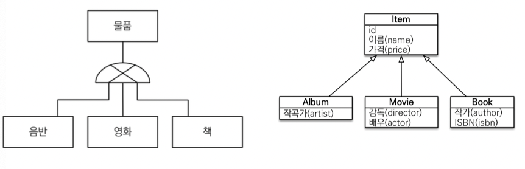
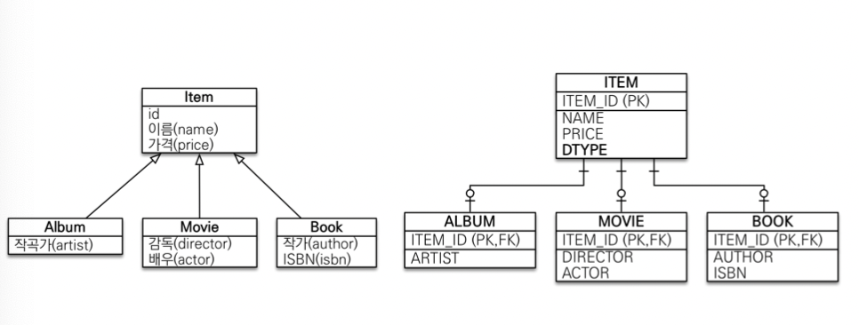
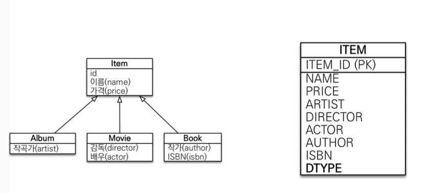
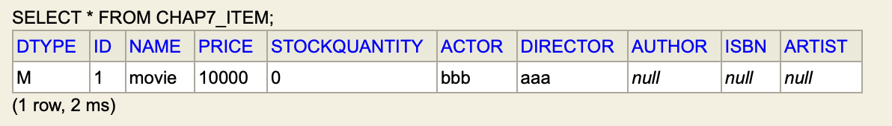
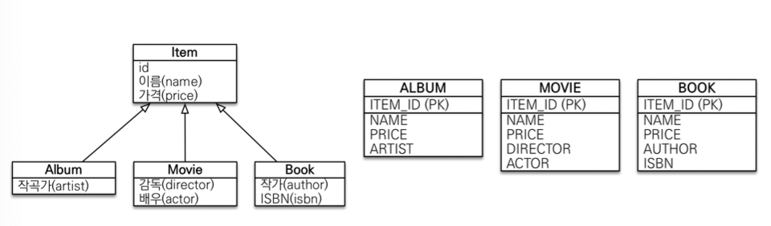
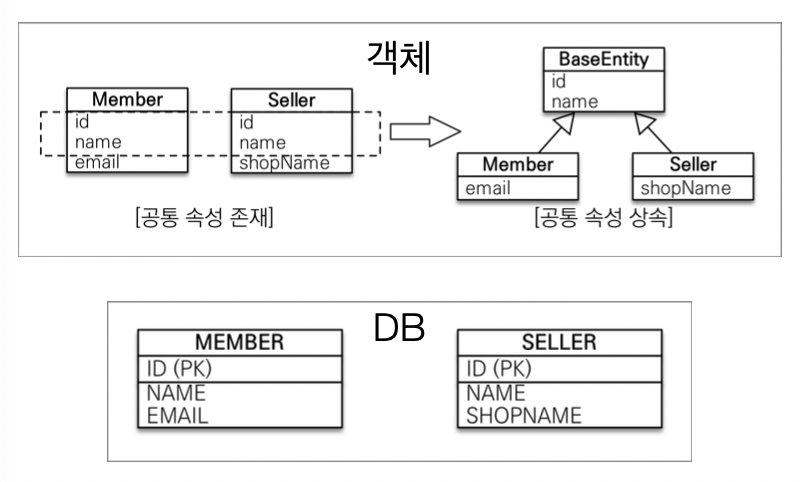

### 상속관계 매핑
<hr>

* RDB : 상속 관계x
* 객체의 상속과 유사한 RDB의 슈퍼타입, 서브타입 관계를 매핑
    

* 논리 모델 -> 물리 모델로 구현하는 3가지 방법
  * 각각의 테이블 -> 조인 전략
  * 통합 테이블 -> 단일 테이블 전략
  * 서브타입 테이블 -> 구현 클래스마다 테이블 전략
  * 주요 어노테이션
    * @Inheritance(strategy=InheritanceType.XXX)
        * JOINED
        * SINGLE_TABLE
        * TABLE_PER_CLASS
    * @DiscriminatorColumn(name="dtype(구분자 필드명)") : 자식 테이블을 dtype으로 구분
    * @DiscriminatorValue("xxx(구분자 값))

* 조인 전략
    
  * JPA와 가장 유사한 방식
  * 장점
    * 테이블 정규화 => 설계가 깔끔하다
    * 외래키 참조 무결성 제약조건 활용 가능
    * 저장공간 효율화
  * 단점
    * 조회 시 조인 사용 -> 성능 저하 & 조회 쿼리가 복잡
    * 데이터 저장 시, Insert 쿼리 2번 호출


  * Movie, Album, Book이 Item을 상속받는 경우  
    => 각각의 테이블이 생성되고, 자식 테이블은 부모 테이블과 연관관계를 가진다.
    ```
    Hibernate: 
        
        create table chap7_item (
        DTYPE varchar(31) not null,
            id bigint not null,
            name varchar(255),
            price integer not null,
            stockQuantity integer not null,
            primary key (id)
        )

    Hibernate: 
        
        create table Movie (
        actor varchar(255),
            director varchar(255),
            id bigint not null,
            primary key (id)
        )

    Hibernate: 
        
        alter table Movie 
        add constraint FK2mkalpova1m496918rf6gy4ex 
        foreign key (id) 
        references chap7_item

    Hibernate: 
        
        create table Album (
        artist varchar(255),
            id bigint not null,
            primary key (id)
        )

    Hibernate: 
        
        alter table Album 
        add constraint FKegnis9clf5qd85kyc979lucna 
        foreign key (id) 
        references chap7_item

    Hibernate: 
        
        create table Book (
        author varchar(255),
            isbn varchar(255),
            id bigint not null,
            primary key (id)
        )

    Hibernate: 
        
        alter table Book 
        add constraint FKp71tqsjv9roq9m3hi6pgp3t5v 
        foreign key (id) 
        references chap7_item
    ```
    * movie에 값을 insert할 때  
        => 상속 받은 값은 item 테이블에, 나머지 값은 movie 테이블에 저장되는 insert 쿼리가 두개 발생한다.
        ```
        Hibernate: 
            /* insert hellojpa.jpashop.chap7.Movie
                */ insert 
                into
                    chap7_item
                    (name, price, stockQuantity, DTYPE, id) 
                values
                    (?, ?, ?, 'M', ?)
        Hibernate: 
            /* insert hellojpa.jpashop.chap7.Movie
                */ insert 
                into
                    Movie
                    (actor, director, id) 
                values
                    (?, ?, ?)
        ```

    * movie의 값을 조회할 때  
        => item 테이블과 movie 테이블은 Join하여 조회한다.
        ```
        Hibernate: 
            select
                movie0_.id as id2_4_0_,
                movie0_1_.name as name3_4_0_,
                movie0_1_.price as price4_4_0_,
                movie0_1_.stockQuantity as stockqua5_4_0_,
                movie0_.actor as actor1_10_0_,
                movie0_.director as director2_10_0_ 
            from
                Movie movie0_ 
            inner join
                chap7_item movie0_1_ 
                    on movie0_.id=movie0_1_.id 
            where
                movie0_.id=?
        ```


* 단일 테이블 전략
    
  * dtype 무조건 써주기
  * 장점
    * 조인 필요 없음 => 조회 빠름 & 조회 쿼리 단순
  * 단점
    * 자식 엔티티가 매핑한 컬럼 모두 nullable
    * 테이블이 커질 수 있다. => 조회할 필드가 많아지면서 조회 성능이 느려질 수 있다.

  * movie 테이블에 값을 insert  
    => 모든 속성 값을 item 테이블에 저장하고, 다른 자식 클래스의 속성에는 null이 들어간다.
    ```
    Hibernate: 
        /* insert hellojpa.jpashop.chap7.Movie
            */ insert 
            into
                chap7_item
                (name, price, stockQuantity, actor, director, DTYPE, id) 
            values
                (?, ?, ?, ?, ?, 'M', ?)
    ```
    

  * movie 테이블의 값을 조회  
    => movie의 속성만 조회한다.
    ```
    Hibernate: 
        select
            movie0_.id as id2_2_0_,
            movie0_.name as name3_2_0_,
            movie0_.price as price4_2_0_,
            movie0_.stockQuantity as stockqua5_2_0_,
            movie0_.actor as actor6_2_0_,
            movie0_.director as director7_2_0_ 
        from
            chap7_item movie0_ 
        where
            movie0_.id=? 
            and movie0_.DTYPE='M'
    ```

* 구현 클래스마다 테이블 전략
    
  * 추천하지 않는 전략!!
  * 상위 클래스 테이블을 생성하지 않으려면 추상 클래스로 생성
  * 장점
    * 서브 타입 명확하게 구분 가능
    * not null 제약 조건 사용 가능
  * 단점
    * 여러 자식 테이블을 조회할 때 성능 느림 (union) & 통합해서 쿼리하기 어려움

* 복잡하지 않을 경우 단일 테이블 전략, 어느 정도 관리가 필요할 때 조인 전략

### mapped superclass - 매핑 정보 상속
<hr>

* 공통 매핑 정보가 필요할 때 사용
    
    * 문의글, 공지사항 등의 경우 작성자, 작성 시각, 수정 시각 등이 필요한데, 이럴 경우 속성을 묶어서 상속하여 사용 가능.
    * 데이터베이스와는 전혀 무관하다. => entity manger 조회, 검색 불가
    * 자식 클래스에 매핑 정보만 제공
    * 추상 클래스 권장!

  * BaseEntity를 상속받는 Post
    ```java
    @Entity
    @Getter
    @Setter
    @NoArgsConstructor
    @AllArgsConstructor
    public class Post extends BaseEntity{

        @Id
        @GeneratedValue
        private Long id;

        private String content;

        public Post(String createdBy, LocalDateTime createdDate, String lastModifiedBy, LocalDateTime lastModifiedDate) {
            super(createdBy, createdDate, lastModifiedBy, lastModifiedDate);
        }

        public Post(String createdBy, LocalDateTime createdDate, String lastModifiedBy, LocalDateTime lastModifiedDate, String content) {
            super(createdBy, createdDate, lastModifiedBy, lastModifiedDate);
            this.content = content;
        }
    }


    @Getter
    @Setter
    @MappedSuperclass
    public class BaseEntity {

        private String createdBy;
        private LocalDateTime createdDate;
        private String lastModifiedBy;
        private LocalDateTime lastModifiedDate;
    }
    // => 생성, 수정 정보 등을 이벤트 리스너를 이용해 자동으로 채울 수 있다.
    ```
    ```
    Hibernate: 
    
        create table Post (
            id bigint not null,
            createdBy varchar(255),
            createdDate timestamp,
            lastModifiedBy varchar(255),
            lastModifiedDate timestamp,
            content varchar(255),
            primary key (id)
        )
    ```

### 참고사항
<hr>

* @Entity클래스는 @Entity나 @MappedSuperClass로 지정한 클래스만 상속 가능