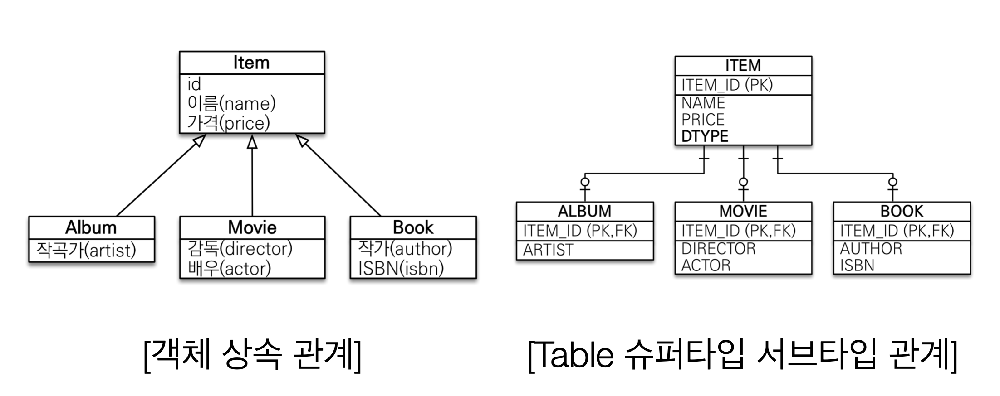
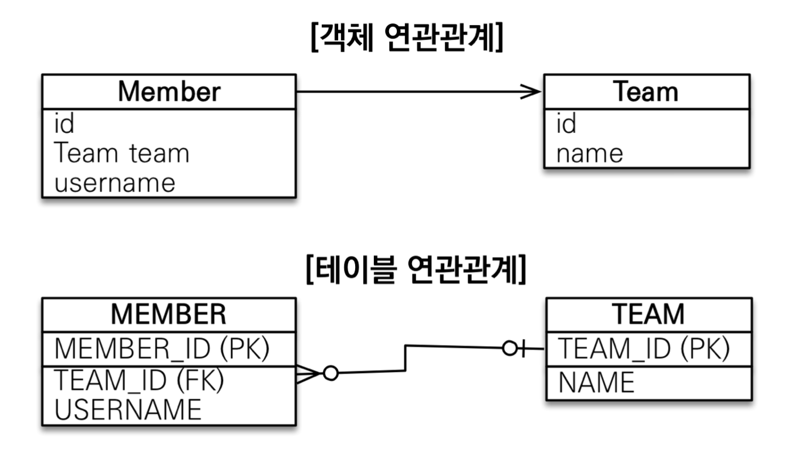
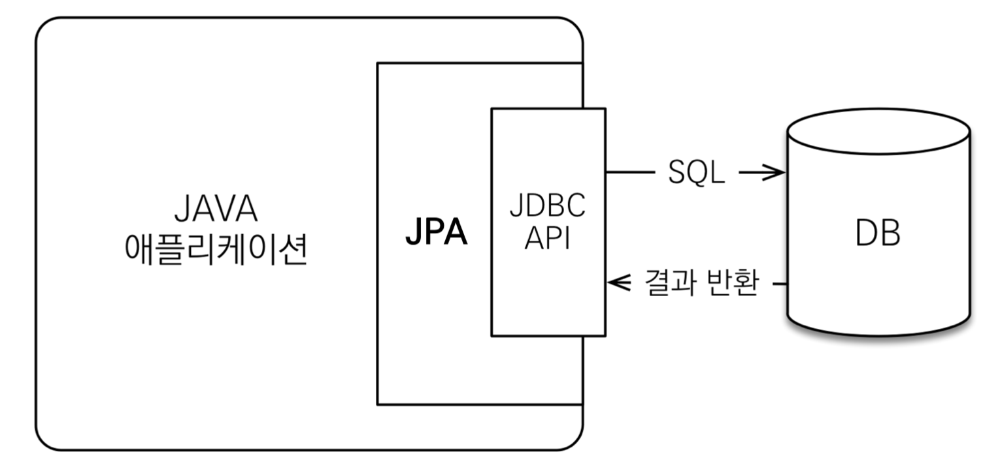
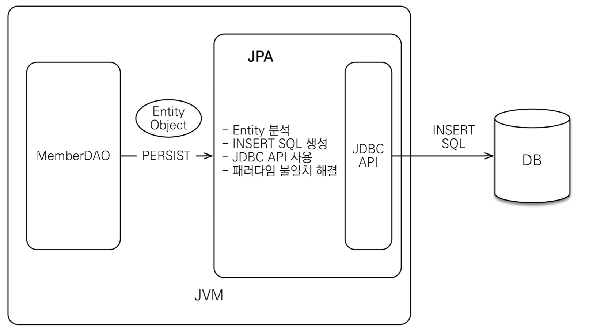
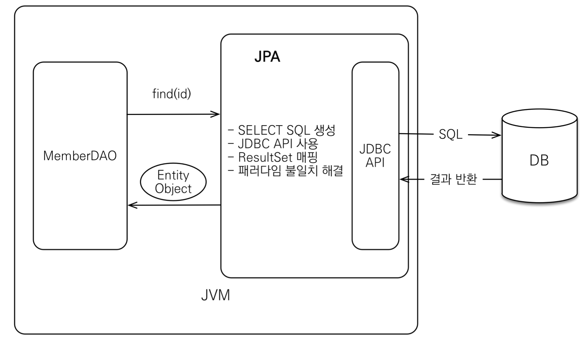
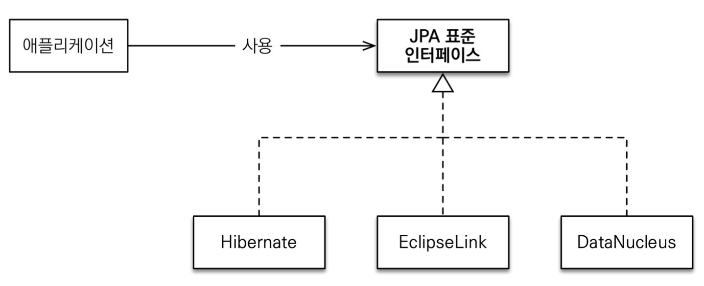
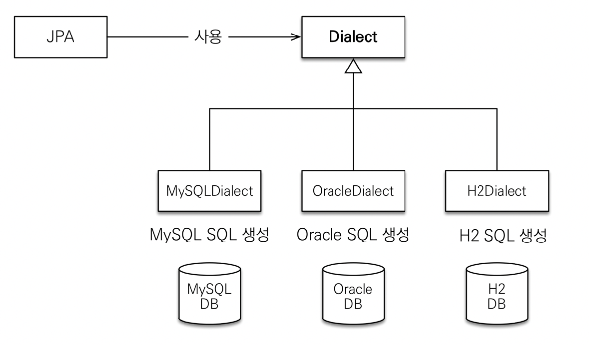
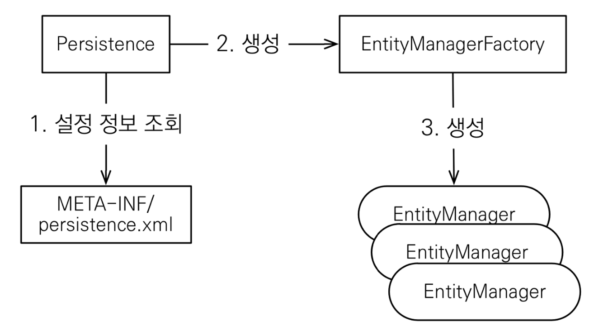

### 1. SQL 중심적인 개발의 문제점
<hr>

현재는 객체를 관계형 DB에 정리하는 시대로 관계형 DB가 이해할 수 있는 SQL이 무조건 필요하다. 이 떄 객체 중심이 아니라 SQL 중심으로 개발이 이루어질 떄 문제가 발생한다.
1. 반복적인 crud를 개발자가 무한 반복하여 sql을 작성하면 시간, 개발 생산성, 유지 보수의 측면에서 좋지 않다. 객체와 sql 변환의 무한 반복이다.
    ```
    public class Memeber {
        private String memberId;
        private String name;
    }

    //sql
    insert into member(member_id, name) value (..., ...);
    select * from memeber m;
    update member set member_id="...";

    //JPA
    em.persist(memeber);
    em.find(member, id);
    member.setId(...);
    ```
    위와 같은 예시에서 sql보다 JPA를 이용했을 때 코드도 짧고, 보기에 좋다. 실제로 age라는 필드를 추가한다고 하면, sql은 필드를 하나씩 모두 추가해줘야 하지만, JPA에서는 정말 "필드만" 추가하면 된다.

2. 패러다임의 불일지 : 객체 <-> 관계형 데이터베이스<br>
    관계형 데이터베이스의 목적 : 데이터를 정규화하여 보관<br>
    객체의 목적 : 필드나 메서드를 캡슐화하여 사용<br>
    (객체 지향 프로그래밍은 추상화와 캡슐화, 정보은닉, 상속, 다형성 등 시스템의 복잡성을 제어할 수 있는 다양한 장치들을 제공한다.)<br>

    * 객체와 관계형 데이터베이스의 차이
        1. 상속<br>
            데이터베이스에는 상속 관계가 존재하지 않는다.
            <br>
            (그나마 상속과 유사한 형식의 데이터베이스, 하지만 동작 방식은 전혀 다르다.)
        2. 연관관계<br>
            객체 지향 언어 : 객체 참조<br>
            관계형 데이터베이스 : pk, fk를 이용하여 조인
            <br>
            (객체의 경우, Member는 Team을 조회할 수 있지만, Team은 Member를 조회할 수 없다. 테이블의 경우, 외래키로 조인하기 때문에 양쪽에서 서로를 조회할 수 있다.)

        3. 데이터 타입
        4. 데이터 식별 방법
3. 객체 그래프 탐색
    처음 실행하는 sql에 따라 탐색 범위가 정해진다. (select member_id from member;) 쿼리로 조회된 결과값에서 추후에 name을 조회하기 위해서는 다시 sql을 작성해야 한다. <br>
    언제나 name을 조회할 수 있다는 보장이 없기 때문에 객체에 대한 신뢰도가 떨어진다.<br>
    레이어드 아키텍처에서 진정한 의미의 계층 분할이 어렵다. 자바 컬렉션은 항상 동일한 객체임을 보장한다.<br>

객체답게 모델링 할수록 매핑 작업만 늘어나며, 매핑이 용이하게 하기 위해서는 여러 도메인을 한 객체로 저장해야 한다. 이런 문제 때문에 "객체를 자바 컬렉션에 저장하는 DB에 저장"할 수 있는 JPA가 고안되었다.

### 2. JPA 소개
<hr>
* JPA : Java Persistence API<br>
* 자바 진영의 orm 기술 표준<br>
객체와 관계형 데이터베이스는 각자의 방식대로 설계하고 orm 프레임워크가 중간에서 매핑 역할을 한다. 따라서 orm은 객체와 rdb 두 기둥 위에 서 있는 기술이다.

1. JPA의 동작<br>
   JPA는 애플리케이션과 JDBC 사이에서 동작한다. orm이 객체와 관계형 데이터베이스의 패러다임 불일치 문제를 해결.
   
    * 저장
        
    * 조회
        
2. JPA의 등장
   EJB (엔티티 빈, 자바 표준) -> hibernate (오픈 소스) -> JPA(자바 표준)<br>
    

3. JPA를 사용해야 하는 이유
   * SQL 중심적인 개발에서 객체 중심으로 개발(생산성) -> crud의 간소화
   * 유지보수 -> 기존에는 필드 수정 시, 모든 sql 수정
   * 패러다임의 불일치 해결
        1. JPA와 상속
        2. JPA와 연관관계
        3. JPA와 객체 그래프 탐색 (신뢰, 자유로운 탐색)
        4. JPA와 비교하기 (동일한 트랜잭션에서는 동일한 객체임을 보장)
   * 성능
        1. 1차 캐시와 동일성(identity) 보장
            1. 같은 트랜잭션 안에서는 같은 엔티티를 반환
            2. DB Isolation Level이 Read Commit이어도 애플리케이션에서 Repeatable Read 보장
        2. 트랜잭션을 지원하는 쓰기 지연(transactional write-behind) 
            1. 트랜잭션을 커밋할 때까지 INSERT SQL을 모음 (버퍼링)
            2. JDBC BATCH SQL 기능을 사용해서 한번에 SQL 전송
            3. UPDATE, DELETE로 인한 로우(ROW)락 시간 최소화
            4. 트랜잭션 커밋 시 UPDATE, DELETE SQL 실행하고, 바로 커밋
        3. 지연 로딩(Lazy Loading)
           1. 지연로딩 : 객체가 실제 사용될 때 로딩
                멤버 조회 : select * from member ...
                member.getTeam() : select * from Team ...
           2. 즉시 로딩: JOIN SQL로 한번에 연관된 객체까지 미리 조회
                select m.*, t.* from member m join team t ...

### 3. JPA 미리보기
<hr>

* 프로젝트 세팅
maven은 pom.xml에서 의존성을 설치한다. jpa 설정은 META-INF/persistence.xml에서 읽어온다. 이름이 다를 경우 에러가 발생한다.<br>
JPA는 자바 표준 javax 라이브러리를 사용한다.<br>
의존성을 설치하면 hibernate-dialect가 있는데, 이것은 말 그대로 방언으로 데이터베이스 플랫폼마다 다른 sql 문법을 사용자가 사용하는 데이터베이스에 맞게 실행할 수 있도록 한다. -> 데이터베이스 플랫폼에 종속적이지 않음.



* JPA 구동 방식
<br>


* JPA를 사용하기 위해서는 데이터베이스에 동작을 수행하는 entityManager가 필요하다. (manager : 스레드간 공유 불가능)
* entityManager는 entityManagerFactory가 관리한다. (factory : 스레드간 공유 가능)
* entityManagerFactory는 하나만 생성해서 애플리케이션 전체에서 공유하며, entityManager는 여러 개가 생성될 수 있다.
* 사용자 요청 시, entityManager가 생성되고, 동작이 끝나면 entityManager를 닫고 버린다.
* entityManager는 데이터를 변경할 때 transaction 내에서 동작을 수행해야 한다. (transaction 내부에서 요청하지 않으면, 오류가 발생하지는 않지만 아무런 쿼리도 날라가지 않는다.)
  

1. 데이터베이스 요청 전 준비
    ```
        // entityManagerFactory 생성 -> entityManager 생성 -> 트랜잭션 생성 -> 트랜잭션 시작
        EntityManagerFactory emf = Persistence.createEntityManagerFactory("hello");
        EntityManager em = emf.createEntityManager();
        EntityTransaction tx = em.getTransaction();
        tx.begin();

        try {
            //데이터 처리 요청

        } catch (Exception e) {
            tx.rollback();
        } finally {
            em.close();
        }

        tx.commit();
        em.close();
        emf.close();
    ```
    <br>
2. 데이터베이스 테이블과 그에 매핑할 클래스 생성
    ```
    @Entity
    public class Member {
        @Id
        private Long id;
        private String name;
    }
    ```
    * @Entity : 데이터베이스 테이블과 매핑할 객체 = JPA가 관리할 객체
    * @Id : 데이터베이스 PK와 매핑
    * 일반적으로 관례를 따라 Member 클래스는 member 테이블과 매핑. memberId는 member_id 컬럼과 매핑된다. 이런 관례에 따르지 않는 이름을 사용하고 싶다면 각각 @Table, @Column 애노테이션을 사용할 수 있다.
    <br><br>
3. 데이터 저장 (persist)
    ```
    Member member = new Member();
    member.setId(1L);
    member.setName("HelloA");
    em.persist(member);
    ```
    <br>
4. 데이터 조회 (find)
    ```
    em.find(Member.class, 1L);
    ```
    * 조건이 있는 조회를 위해 JPA는 SQL을 추상화한 JPQL을 제공한다.<br>
    SQL과 거의 유사한 형식이지만, 데이터베이스 테이블이 대상이 아니라 자바 객체를 대상으로 한다. 데이터베이스 테이블을 대상으로 하면 플랫폼마다 다른 sql을 짜야되고 그러면 플랫폼에 과도하게 의존하게 된다. JPQL은 이러한 문제점을 없애기 위해 SQL을 추상화한 객체 중심의 ***객체 지향 SQL***이라고 볼 수 있다.
    ```
    List<Member> result = em.createQuery("select m from Member m", Member.class)
        .setFirstResult(5)
        .setMaxResults(8)
        .getResultList();
    ```
    또 SQL과 다른 점은 페이징, limit(rownum) 등 여러 기능을 함수로 제공한다는 것이다.
    <br>
5. 데이터 수정 (setter)
    ```
    Member findMember = em.find(Member.class, 1L);
    findMember.setName("HelloJPA");
    ```
    Setter를 이용하여 객체의 값을 수정하면, entityManager가 더티체크(수정사항이 있는지 확인)를 하여 persist가 없어도 수정 쿼리를 날린다. JPA는 최대한 자바 컬렉션을 다루는 것처럼 사용할 수 있도록 설계되었다.
    <br><br>
6. 데이터 삭제 (remove)
    ```
    Member findMember = em.find(Member.class, 1L);
    em.remove(findMember);
    ```
    <br>
### 용어 정리
* orm : object relational mapping(객체 관계 매핑)