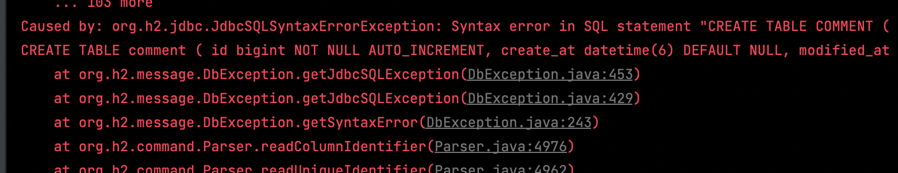

### @AutoConfigureDataJpa
<hr>


### @AutoConfigureTestDatabase
<hr>

* AutoConfigureTestDatabase.Replace.NONE 옵션을 주지 않았을 때  
    => local에는 mysql 데이터베이스를 연결했다.

```java
@ActiveProfiles("local")
@DataJpaTest
```



=> mysql로 실행하도록 설정했지만, h2로 실행이 되었다. 그런데 schema는 h2로 자동생성 되지 않아 오류가 발생했다.

* 테스트 실행 시, 스프링 컨테이너 로딩 로그
* 
```
2022-05-04 14:42:12.898  INFO 6421 --- [           main] n.t.s.f.domain.FollowRepositoryTest      : The following 2 profiles are active: "s3", "local"
// ActiveProfiles 설정에 맞게 local 환경으로 실행

2022-05-04 14:42:12.996  INFO 6421 --- [           main] o.s.j.d.e.EmbeddedDatabaseFactory        : Starting embedded database: url='jdbc:h2:mem:68373e3b-4fc8-4c32-b893-35fc942abeba;DB_CLOSE_DELAY=-1;DB_CLOSE_ON_EXIT=false', username='sa'
// Replace.NONE 옵션을 주지 않아 임베디드 데이터베이스로 실행

2022-05-04 14:42:13.018  INFO 6421 --- [           main] org.hibernate.dialect.Dialect            : HHH000400: Using dialect: org.hibernate.dialect.MySQL57Dialect
// local 구성에 따라 mysql dialect 사용
```

* ActiveProfile와 AutoConfigureTestDatabases는 별개로 움직임을 알 수 있다.
* schema.sql은 mysql 문법으로 작동되었으나, 실행 환경은 h2였기 때문에 오류가 발생했다.

```java
@ActiveProfiles("local")
@DataJpaTest
@AutoConfigureTestDatabase(replace = NONE)
```
* replace = NONE 옵션을 주면 테스트가 성공한다.
* Starting embedded database 로그는 볼 수 없지만, Starting local database 뭐 이런 것도 볼 수 없었다. 내가 못 찾은 거일 확률이 높지만...  
    아무튼 테스트도 통과하고 정상적으로 작동함을 알 수 있다.