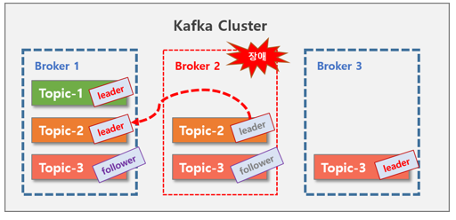

### Kafka란?
<hr>

* 분산형 스트리밍 플랫폼 (A distributed streaming platform)
* pub-sub 구조 : 사용자가 토픽을 구독함으로써 메시지를 읽어올 수 있는 방식
* 특징
  * 대용량 실시간 로그처리에 특화되어 있어 tps가 우수함
  * 메시지를 메모리가 아니라 파일에 저장해, 메시지 유실이 적음  
    (hdd는 메모리보다 수백배 느리지만, 순차적 읽기 능력은 비슷해 성능 유지 가능)
  * consumer가 broker로부터 메시지를 직접 가져가는 pull 방식  
    (rabbitMQ는 broker가 consumer에게 메시지를 push해 주는 방식)


### 구성 요소

#### topic, partition, offset
<hr>

* 메시지는 topic으로 분류  
* topic은 여러 개의 partition으로 나누어질 수 있음  
* partition 내부에는 message의 상대적 위치를 나타내는 offset이 존재  
* offset : 이전에 가져간 메시지의 위치 정보를 알 수 있음, 동시에 들어오는 데이터를 여러개의 파티션에 나누어 저장하기 때문에 병렬 처리 가능  
  
<br>

#### producer, consumer, consumer group
<hr>

* 생산자와 소비자는 상호 존재 여부를 모르고 자신의 역할만 함  
* consumer group  
  여러 파티션에 존재하는 메시지를 여러 소비자가 읽어가는 것이 효율적  
  consumer group은 하나의 토픽을 읽어가기 위한 consumers  
  * consumer group의 규칙  
    topic의 파티션은 group과 1:n 매칭 (자신 읽고 있는 파티션에는 같은 그룹 내 다른 컨슈머가 읽을 수 없다.)  
    

    * 일반적으로 컨슈머, 파티션의 갯수는 동일하게 구성
      

    * 데이터를 벙렬로 읽을 수 있어 빠른 처리가 가능
    * 특정 컨슈머에 문제 발생 시, ***다른 그룹 내 컨슈머가 대신 읽을 수 있게 리밸런싱되어 장애 상황 대처 가능***
<br>

#### broker, zookeeper
<hr>

* broker  
  kafk 서버    
  동일한 노드 내 여러 개의 broker 서버 구동 가능
* zookeeper  
  분산 메시지 큐의 정보를 관리해주는 역할    
  kafka를 구동시키기 위해서는 주키퍼의 실행이 필수

<br>

#### replication
<hr>

* replication  
  kafka에서는 replication 수를 임의로 지정하여 topic을 만들 수 있음  
  replication-factor에서 지정해주는 수만큼 replication 생성  

  
   
  * 필요성 : 단순 복제의 용도 x, 특정 broker에 문제 발생 시, 다른 broker가 즉각적으로 대신 수행할 수 있게 하기 위한 용도

<br>

* **replication 내의 역할**
  * leader : 복제 요소 중 대표 (**모든 데이터의 read/write은 leader에서 이루어짐**)
  * follower : 그 외 (**leader와 동기화(sync)를 유지**함으로써 leader에 문제가 생겼을 경우 follower등 중 하나가 leader의 역할)  
  
  
  <br>

* 복제된 데이터가 follower에게 있으니 메시지의 유실이 없지만, 복제를 위한 시간, 네트워크 비용이 들기 때문에 데이터의 중요도에 따라 ack 옵션으로 성능, 데이터의 중요도를 세부 설정
  ```
  0 : propducer는 서버로부터 ack를 기다리지 않아, 유실율은 높으나 처리량이 높음
  1(default) : leader는 데이터를 기록하고 모든 follower는 확인하지 않음
  -1(or all) : 모든 ISR 확인, 무손실

  => 속도 vs 데이터 보존/안정성 중에서 중요하게 생각하는 요소를 기준으로 설정할 수 있음
  ```

* producer는 메시지 입력, consumer에서 메시지를 읽어갈 떄 zookeeper에서 broker 및 offset 정보를 관리하기 때문에 분산처리가 가능   
  
<br>

* ISR(In-Sync-Replicas) : 리더와 팔로워가 모두 동기화된 상태
<br>

### 메시지 큐란?
<hr>

* MOM을 구현한 시스템
* 메시지 지향 미들웨어(Message Oriented Middlware: MOM) : 비동기 메시지를 사용하는 다른 응용프로그램 사이의 데이터 송수신을 의미


* 아래 문서를 요약 정리한 것입니다.  
<a href="https://team-platform.tistory.com/11">https://team-platform.tistory.com/11</a>