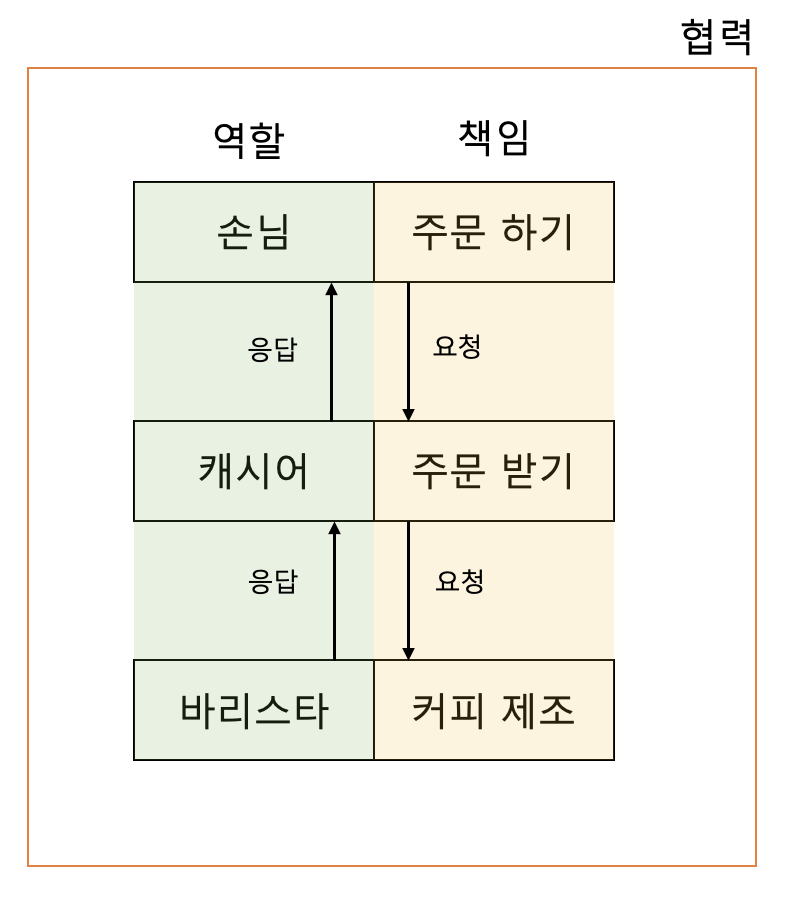

`
시너지를 생각하라. 전체는 부분의 합보다 크다. - 스티븐 코비
`

1. 객제지향 프로그래밍
  * 현실 속에 존재하는 사물을 최대한 유사하게 모방해 sw 내부로 옮겨오는 작업
  * => 실세계의 투영
  * => 객체 : 현실 세계에 존재하는 사물에 대한 추상화
  * 목표 : 실세계를 모방하는 것이 아니라 새로운 세계를 창조하는 것
   
   
2. 연결완전성 (seamlessness)
    * 객체지향 설계의 핵심적 사상
    * 실세계의 사물을 기반으로 소프트웨어 객체를 식별하고 구현까지 이어간다.
  
3. 객체지향에서 가장 중요한 개념
        
        
  * 역할 : 협력 안에서 차지하는 책임, 의무  
    관련성 높은 책임의 집합
  * 책임 : 역할 안에 내포되어 있는 개념
  * 협력
    * 여러 사람이 동일한 역할을 수행할 수 있다.  
        캐시어 역할을 하는 사람이 여러 명일 수 있다.
    * 역할은 대체 가능성(substituable)을 의미한다.  
        여러 명의 사람 중 누가 캐시어 역할을 하든 상관이 없다.
    * 책임을 수행하는 방법은 자율적으로 선택할 수 있다.(다형성, polymorphism)  
        바리스타는 원하는 방식으로 커피를 제조할 수 있다.
    * 한 사람이 동시에 여러 역할을 수행할 수 있다.  
        캐시어가 바리스타의 역할을 같이 할 수 있다.
  

4. 요청과 응답
  * 문제를 해결하기 위해 사람들(역할)은 요청과 응답을 주고 받으며, 다른 사람과 협력한다.
  * 메시지 : 요청을 전달하기 위한 수단
  * 메서드 : 요청을 처리하기 위한 방법
  * => 사람들은 특정한 목표를 이루기 위해 요청과 응답을 통해 목표를 달성한다.
  * => 객체는 애플리케이션의 기능을 구현하기 위해 협력한다.
  * => 객체의 적절한 책임이 객체지향 설계의 품질을 결정 짓는다.
  

5. 객체의 두 가지 덕목
   1. 협력적  
        * 역할과 책임을 분할하여, 다른 객체의 도움을 받아야 한다.
   2. 자율적
        * 협력적이되 수동적이어서는 안 된다.
        * 어떤 방식으로 응답할지 객체 스스로 판단, 결정한다.

  

6. 상태(state)와 행동(behavior)
    * 객체는 상태와 행동을 함께 지닌 실체
    * 바리스타가 커피를 제조하기 위해 제조 방법을 알고 있듯, 객체가 어떤 행동을 하기 위해 필요한 상태를 지니고 있어야 한다.
    * => 객체가 자율성을 지닐 수 있다.
  

7. 객체의 자율성
    * 객체의 내부와 외부를 명확하게 구분하는 것에서 시작
      * 다른 객체가 무엇(what)을 수행하는 지 알 수 있다.
      * 다른 객체가 어떻게(how) 수행하는 지 알 수 없다.
    * 자신의 상태를 직접 관리하고 상태를 기반으로 스스로 판단, 행동할 수 있음
    * 커피 제조 방법을 알고 있고, 그 중 어떤 방식으로 제조할 지 스스로 판단
    * => 과거와는 다르게 데이터와 프로세스를 객체 안에 묶어둠
  

8. 메서드와 자율성
    * 메시지 : 요청을 위한 수단 (송신, 수신)
    * 메서드 : 수신된 메시지를 처리하는 방법
    * 절차지향 언어 : 프로시저 호출에 대한 실행 코드를 컴파일 시간에 결정
    * 객체지향 언어 : 객체가 실행 시간에 메서드를 선택
    * 메시지와 메서드의 분리 => 자율성 증진 => 캡슐화와 관련
  

9. 객체지향의 본질
    * 객체지향 : 시스템을 상호작용하는 자율적인 객체들의 공동체로 바라보고 객체를 이용해 시스템을 분할하는 방법
    * 자율적인 객체 : 상태와 행위를 함꼐 지니며 스스로를 책임지는 객체
    * 객체는 시스템의 행위 구현을 위해 다른 객체와 협력 => 정해진 역할을 수행, 역할은 관련된 책임의 집합
    * 객체는 협력을 위해 메시지를 전송하고, 수신자는 메시지 처리를 위한 메서드를 자율적으로 선택
  

10. 객체를 지향하라
    * 중요성 : 클래스 < 객체
    * 클래스가 중요한 구성요소인 것은 맞지만 객체지향의 핵심을 이루는 중심 개념은 아니다.  
        프로토타입 기반 객체지향 언어(ex.자바스크립트)에는 클래스가 존재하지 않고 객체만 존재. 클래스 상속 대신 객체 간의 위임(delegation)
    * 클래스 강조 시 : 캡슐화 저해, 클래스 결합도 강해짐
    * 코드를 담는 클래스 -> 메시지를 주고받는 객체 관점으로 사고 전환
